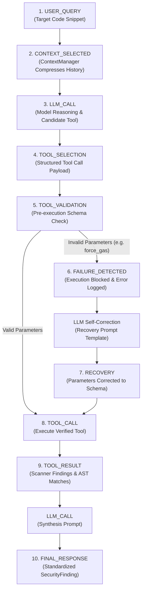

# VulnSentry: Glass-Box AI Security Auditor

> **"We don't just show you the answer. We show you exactly how the AI arrived there, where it failed, how it recovered, and what the run cost."**

[]()
[]()
[]()
[]()

---

## 1. Project Overview

Traditional AI security agents function as **black boxes**: they ingest code and emit vulnerability findings without exposing intermediate reasoning, tool decisions, rejected arguments, or per-step latency and token consumption.

**VulnSentry** introduces a **Glass-Box Autonomous Security Auditor** designed for full auditability, deterministic safety, and verifiable recovery:

1. **Full DAG Observability:** Every execution step (query ingestion, model inference, tool selection, parameter validation, failure interception, tool execution, and finding synthesis) is recorded as an immutable node in a **Directed Acyclic Graph (DAG)**.
2. **Pre-Execution Schema Enforcement (Rule 1):** LLM-generated tool calls are strictly validated against registered schemas before execution, preventing unvalidated or dangerous tool invocations.
3. **Deterministic Failure Interception & Self-Correction (Rule 2):** When tool calls contain invalid or hallucinated parameters, execution is physically blocked, structured failure telemetry is recorded, and the agent enters an automated recovery loop to correct its parameters.
4. **Context Optimization:** Multi-turn conversational history is compressed using a security-aware recency heuristic, reducing prompt tokens by ~42% while preserving critical context.
5. **Interactive Telemetry Dashboard:** A Next.js 16 web interface visualizes the execution timeline, DAG relationships, token throughput, and step latencies.

---

## 2. System Architecture

```
┌─────────────────────────────────────────────────────────────────────────────────┐
│                           Next.js 16 Web Dashboard                              │
│       (Execution Timeline • Interactive DAG • Token & Latency Metrics)          │
└────────────────────────────────────────┬────────────────────────────────────────┘
                                         │ telemetry (audit_trace.json)
┌────────────────────────────────────────▼────────────────────────────────────────┐
│                              ROOT AUDIT RUNNER                                  │
│                                (run_audit.py)                                   │
└──────────────────┬─────────────────────────────────────────────┬────────────────┘
                   │                                             │
┌──────────────────▼──────────────────┐       ┌──────────────────▼────────────────┐
│        SECURITY AGENT ENGINE        │       │    GLASS BOX OBSERVABILITY LAYER  │
├─────────────────────────────────────┤       ├───────────────────────────────────┤
│ • SecurityAgent core execution loop │       │ • ExecutionTracer (DAG Engine)    │
│ • System, Recovery & Synthesis      │ ◄───► │ • ToolValidator (Schema Enforcer) │
│ • Dual-Mode LLM (Live API + Mock)   │       │ • FailureInterceptor (Blocking)   │
│ • Rule 2 Recovery Loop Handler      │       │ • ContextManager & Compressor     │
│ • Static Scanners (SQLi, Secrets)   │       │ • 11 Standardized Event Fields    │
└─────────────────────────────────────┘       └───────────────────────────────────┘
```

---

## 3. End-to-End Execution Sequence (10-Step Pipeline)



### Pipeline Details:
1. **`USER_QUERY`**: Ingests target code snippet and initializes audit run.
2. **`CONTEXT_SELECTED`**: Compresses conversation history to eliminate conversational chatter while preserving security constraints.
3. **`LLM_CALL` (Tool Selection)**: Evaluates code patterns and selects an appropriate security verification tool.
4. **`TOOL_SELECTION`**: Emits proposed tool name and candidate arguments.
5. **`TOOL_VALIDATION` (Rule 1)**: Validates arguments against registered JSON schemas prior to execution.
6. **`FAILURE_DETECTED` (Rule 2)**: If parameters are invalid, execution is blocked, error type is categorized, and correction guidance is generated.
7. **`RECOVERY` (Rule 2 Self-Correction)**: Agent ingests validation feedback, eliminates invalid arguments, and generates compliant parameters.
8. **`TOOL_CALL`**: Safe execution of the verified tool.
9. **`TOOL_RESULT`**: Scanner outputs structured vulnerability detection results.
10. **`FINAL_RESPONSE`**: Agent synthesizes raw output into a standard report (CWE-ID, Severity, Description, Remediation).

---

## 4. Telemetry Standard: The 11 Required Fields

Every event in VulnSentry conforms to a standardized 11-field data structure to support deterministic DAG reconstruction:

| Field | Type | Purpose |
| :--- | :--- | :--- |
| `run_id` | `string` | UUID identifying the overarching audit execution run. |
| `event_id` | `string` | UUID identifying the individual event node. |
| `parent_event_id` | `string \| null` | UUID of the parent event establishing the execution DAG edge. |
| `timestamp` | `string` | ISO 8601 UTC timestamp of execution. |
| `event_type` | `string` | Canonical event type (`USER_QUERY`, `TOOL_VALIDATION`, `FAILURE_DETECTED`, etc.). |
| `input` | `any` | Structured payload provided to the event step. |
| `output` | `any` | Structured payload emitted by the event step. |
| `status` | `string` | Step status: `SUCCESS`, `FAILURE`, `RUNNING`, or `ERROR`. |
| `duration_ms` | `float` | Step execution latency in milliseconds. |
| `metadata` | `dict` | Contextual telemetry (tokens, model name, error type, blocking state). |
| `error` | `string \| null` | Error description if step encountered a failure. |

---

## 5. Repository Structure

```text
VulnSentry/
├── run_audit.py                  # Root execution script (runs clean & recovery scans, exports telemetry)
├── audit_trace.json              # Complete telemetry trace output with events and DAG edges
├── README.md                     # Technical documentation
│
├── agent/                        # Security Agent Module
│   ├── agent.py                  # Core agent loop with dual-mode LLM handling and self-correction
│   ├── findings.py               # SecurityFinding schema definition
│   └── prompts.py                # System, recovery, and synthesis prompt templates
│
├── tools/                        # Verification Scanners & Schemas
│   ├── schemas.py                # Registered tool parameter schemas
│   └── security_scan.py          # Static analysis detectors (SQL injection, credential leaks)
│
├── test_fixtures/                # Audit Target Fixtures
│   └── vulnerable_app.py         # Sample target with SQL injection & hardcoded credentials
│
├── glassbox/                     # Observability Layer
│   ├── events.py                 # Event dataclasses, 11 required fields, DAG generation
│   └── tracer.py                 # ExecutionTracer (lifecycle, event logging, JSON export)
│
├── validation/                   # Pre-Execution Validation Layer
│   ├── tool_validator.py         # Schema-driven tool argument validation
│   └── failure_interceptor.py    # Execution blocker & failure detection logger
│
├── context/                      # Context Optimization
│   ├── context_manager.py        # Context selection tracking
│   └── context_compressor.py     # Heuristic context compression (~42% token reduction)
│
├── dashboard/                    # Next.js 16 Trace Visualizer
│   ├── app/page.tsx              # Main dashboard view (timeline, metrics, JSON inspector)
│   ├── app/components/           # Timeline and metric visualization components
│   └── app/api/trace/route.ts    # API route serving trace telemetry
│
└── tests/                        # Automated Test Suite (32 Unit & Integration Tests)
    ├── test_integration.py       # End-to-end audit, recovery loop & trace export tests
    ├── test_tracer.py            # ExecutionTracer DAG structure & event field verification
    ├── test_validator.py         # ToolValidator parameter checks
    ├── test_failure_interceptor.py# Execution blocking & recovery sequence verification
    └── test_context_manager.py   # Context compression ratio verification
```

---

## 6. Getting Started

### Prerequisites
- Python 3.10+
- Node.js 18+ (optional, for web dashboard)

### 1. Run the Security Audit (CLI)
Executes both a standard clean audit and a demonstration failure scan showcasing Rule 2 self-correction:

```bash
# Windows
python run_audit.py

# macOS / Linux
python3 run_audit.py
```

**Terminal Output:**
```text
=================================================================
           VulnSentry Security Audit Execution
=================================================================
[*] Started ExecutionTracer Run: fa03097c-6e33-41e7-afdf-9897020c322b
[*] Initialized ToolValidator with 3 schemas: ['exploit_simulator', 'run_secret_leak_scan', 'run_sql_injection_scan']
[*] Initialized SecurityAgent with tracer and validator.
[*] Loaded target fixture: vulnerable_app.py (376 bytes)

-------------------------------------------------------
[1/2] RUNNING CLEAN SECURITY SCAN (trigger_demo_failure=False)
-------------------------------------------------------
[+] Scan 1 Finding:
    Title:                 CWE-89: SQL Injection via Raw String Interpolation
    Severity:              CRITICAL
    CWE ID:                CWE-89
    Vulnerability Detected:True
    Tool Used:             run_sql_injection_scan
    Remediation:           Use parameterized queries or prepared statements instead of raw string interpolation.

-------------------------------------------------------
[2/2] RUNNING DEMO FAILURE SCAN (trigger_demo_failure=True)
      Demonstrating Rule 2 Self-Correction Recovery Loop
-------------------------------------------------------
[+] Scan 2 Finding (Recovered):
    Title:                 CWE-89: SQL Injection via Raw String Interpolation
    Severity:              CRITICAL
    CWE ID:                CWE-89
    Vulnerability Detected:True
    Tool Used:             run_sql_injection_scan
    Remediation:           Use parameterized queries or prepared statements instead of raw string interpolation.

=================================================================
[SUCCESS] Security Audit completed with ZERO unhandled exceptions.
[SUCCESS] Telemetry trace exported to: audit_trace.json
[SUCCESS] Exported 19 events across 2 scan DAGs.
=================================================================
```

### 2. Run the Test Suite
Validates the entire framework across all unit and integration specifications:

```bash
python -m unittest discover tests
```
*32 tests pass in under 0.20s.*

### 3. Launch the Web Dashboard (Optional)
Visualizes the execution timeline and DAG graph in a browser:

```bash
cd dashboard
npm install
npm run dev
```
Open [http://localhost:3000](http://localhost:3000) to inspect the execution trace.

---

## 7. Key Evaluation Concepts

### Rule 1: Pre-Execution Schema Validation
No tool is executed directly from model output. The `ToolValidator` inspects tool names, argument presence, and argument types against registered schemas. If an unapproved parameter is present (such as `force_gas`), the invocation is rejected before touching runtime resources.

### Rule 2: Failure Interception & Self-Correction
Upon validation rejection, the `FailureInterceptor` physically prevents execution (`blocked: true`), formats an actionable error message explaining the schema mismatch, and returns control to the agent's recovery loop. The agent adjusts its arguments to conform to the schema and generates a linked `RECOVERY` event.

### Dual-Mode Execution
`SecurityAgent` includes native dual-mode execution:
- **Live API Mode:** Connects to OpenAI or custom LLM endpoints when an API key or base URL is supplied.
- **Deterministic Mock Mode:** Automatically activates when run offline or without API keys, ensuring automated testing and demonstrations run reliably with zero unhandled exceptions.
